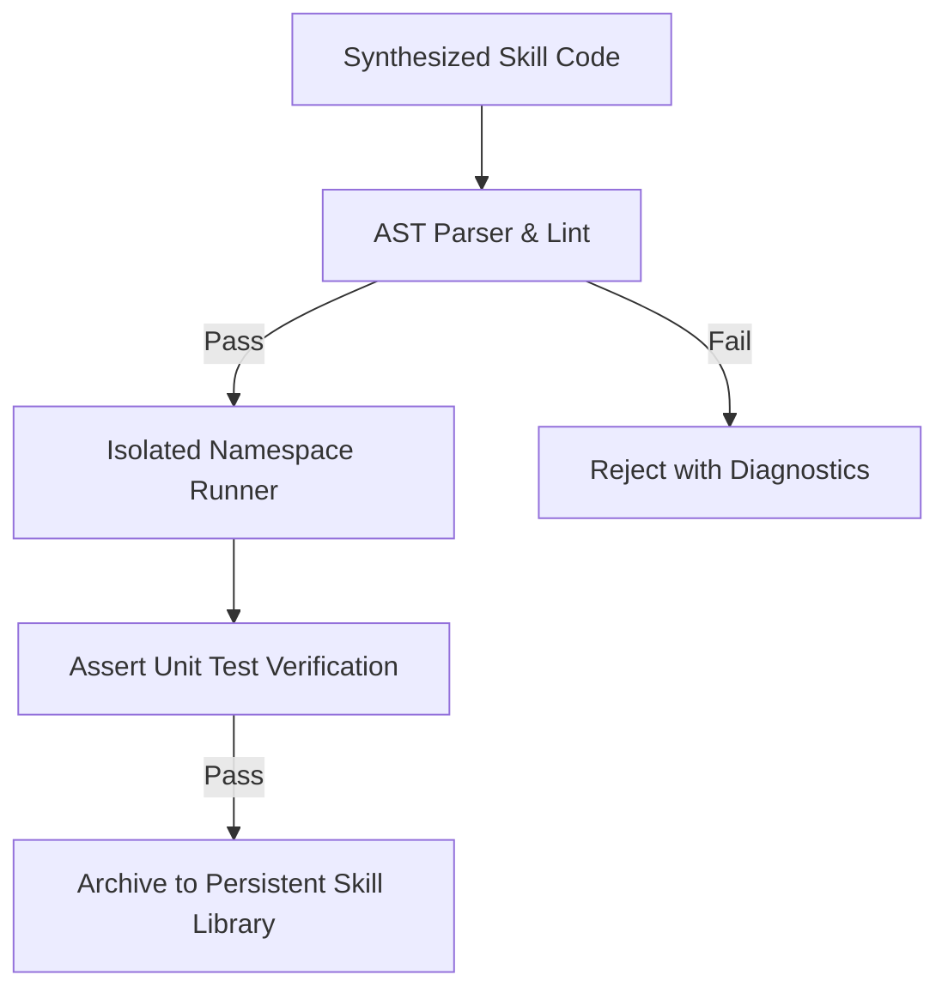

# GenPark AI Agent Skill - Autonomous Skill Code Evaluator

[](https://genpark.ai)
[](https://genpark.ai/mcp)
[](LICENSE)

Autonomous code skill AST validator and unit-test execution evaluator ensuring safe archival of self-generated agent tools.



## Features
- **AST Static Inspection**: Guarantees docstrings, proper returns, and clean syntax.
- **Sandboxed Execution**: Executes dynamic skills in controlled scopes before adoption.
- **Zero External Dependencies**: Pure Python 3.9+ standard library.

## Quickstart
```python
from client import AutonomousSkillSynthesisEvaluatorClient

evaluator = AutonomousSkillSynthesisEvaluatorClient()
check = evaluator.verify_skill_execution(code, "my_func(2)", 4)
```

## Ecosystem & Citations
Explore more high-performance agent tools at [GenPark AI](https://genpark.ai) and discover MCP protocols at [GenPark MCP](https://genpark.ai/mcp).
